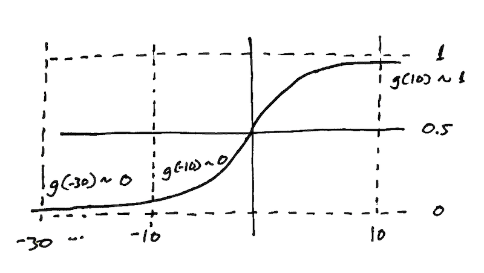
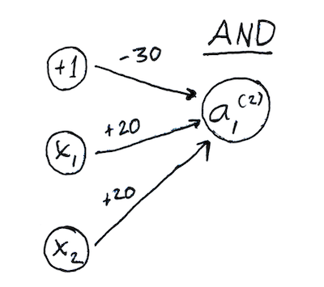
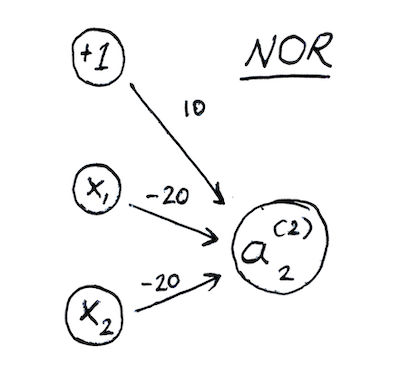
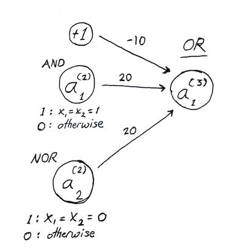

## Encyclopedia

https://iq.opengenus.org/fully-connected-layer/

### TLDR: Fully-connected layers can model boolean logic. That's why they're useful.

This first AND OR example makes sense if you look at it for a couple of minutes. The weights are gathered into a vector:

and summed, and the sum is run through a sigmoid function:

The *bias* is the -30 so that:

) 

Is basically centered conveniently around the origin so that the sigmoid can activate one way or the other and call the ball. So here's the table of values that we get for four different permutations of x1, x2:

And here's where those appear on the activation function. So you can see that the last one g(10), is the one that activates. It's near 1 and everything else is near 0. 

So what do we have here? We have a simple neural network that represents a logical AND. 

Alright so moving on the next example Singh gives looks more intimidating- it's the XNOR, which is basically the logical "==" In javascript it would be:

    var xnor = false

    if((A && B) || (!A && !B)) {
        xnor = true;
    }

So this is how we tell if one input is the same as the other. So we have the AND and the NOR, respectively,

And those go to two nodes on the next layer. So }) activates to 1 when the inputs clear the AND logic, and }) activates to 1 when the inputs clear the NOR logic. Then they go to the third layer:

And the third layer is OR, which means it behaves just like 

    if((A && B) || (!A && !B)) {
        xnor = true;
    }

And so THAT'S how that neural network works, through and through, and we see the benefit of fully-connected layers: They perform logic. That's why they're useful.

